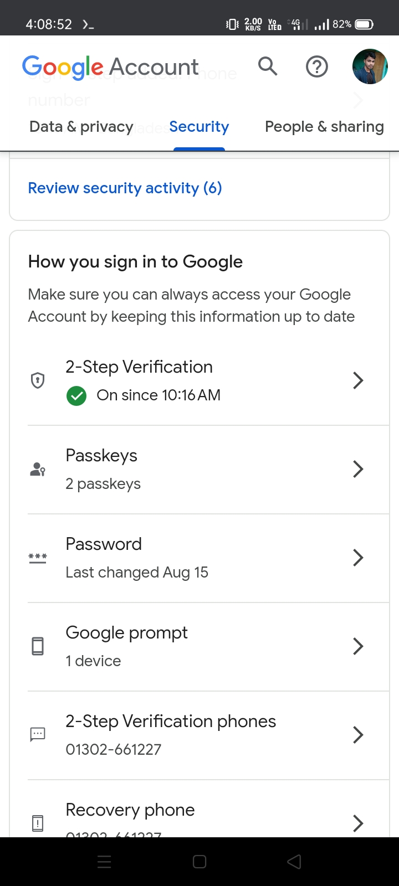
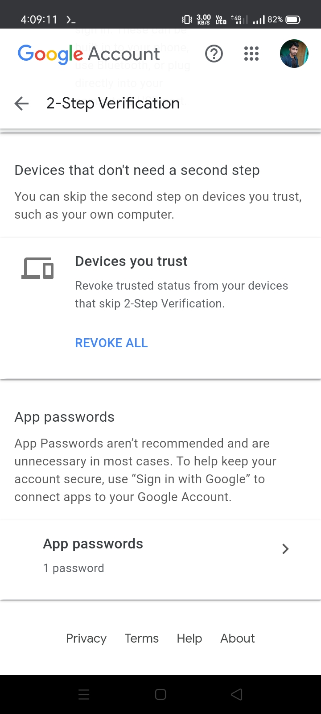
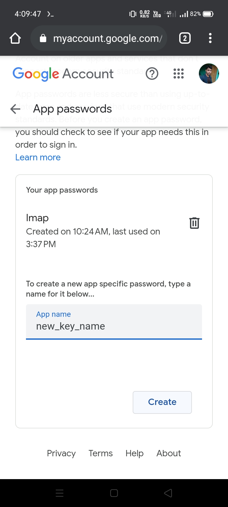

# Developer Ghs Julian 

## Email Deletion Program 

<br><br><br>
<center>
<strong>This Repository Has Made For Deleting Users Emails , when you have so much email in your email inbox . And it's feel like Boring and annoying . Though you want to delete those
emails but you can't. because there's so many emails that you are tired to deleting them . So don't worry about that.
I am programmer i have made this program to remove your headache. Just clone this Repository and follow the command.
</strong>
</center>
<br><br><br>

# Note : 

<br>

<center>
  <br/><br/>
  
    <br/><br/>
  
    <br/><br/>
  
    <br/><br/>
</center>


```
[1] Go to Google Account
[2] Go to Security Tab 
[3] Click 2-Step Verification
[4] Scroll Down And Click App Passwords
[5] Add New apName ex: my_app
[6] Click create 
[7] Copy The App Code Password 
[8] Come back to your terminal and copy the commands.
```

# Cloning Commands :

```
git clone https://github.com/Ghsjulian/Email-Deleter.git && cd Email-Deleter && bash setup.sh 
```
 <br><br>
 <center>
<strong>
  Now Enter Your Email Address : <br>
  
</strong>
</center>
<br><br>

# Example : 

```
email     :    youremai@.com 
password  :    your_app_code
```

## Demo & Screenshots : 


<center>
  <br/><br/>
  
</center>
